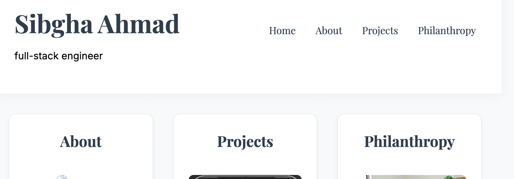

# Sibgha's Homepage

## Author

Sibgha Ahmad

## Project Objective

A personal portfolio website showcasing Sibgha Ahmad's professional work, projects, and philanthropic initiatives. The website serves as a comprehensive platform to highlight achievements and connect with potential collaborators and employers.

## Features

- **Responsive Design**: Built with modern CSS practices ensuring compatibility across all device sizes
- **Smooth Animations**: Incorporates subtle CSS animations for enhanced user experience
- **Project Showcase**: Detailed presentation of projects including "Last Bite Standing"
- **Philanthropy Section**: Highlights involvement with SiliconPrep and educational initiatives
- **Professional Links**: Easy access to professional profiles and contact information

## Technologies Used

- HTML5
- CSS3
- JavaScript
- Google Fonts (Playfair Display, EB Garamond, Inter)
- Font Awesome Icons

## Key Components

1. **Homepage (index.html)**

   - Navigation menu
   - Featured sections showcase
   - Professional introduction

2. **Projects Page (projects.html)**

   - Detailed project descriptions
   - Video demonstrations
   - Technical specifications
   - GitHub repository links

3. **Philanthropy Page (philanthropy.html)**
   - SiliconPrep initiative details
   - Educational outreach information
   - Impact metrics

## Styling Features

- Custom CSS variables for consistent theming
- Responsive grid layouts
- Smooth transitions and animations
- Mobile-first design approach
- Optimized image handling

## Project Structure

├── index.html # Home page
├── about.html # About/Timeline page
├── projects.html # Project showcase
├── philanthropy.html # Social impact work
├── css/
│ └── style.css # Main stylesheet
├── js/
│ └── script.js # Core functionality
└── pictures/ # Media assets

## Dependencies

Font Awesome 5.15.4
Google Fonts (Playfair Display, EB Garamond, Inter)

## Browser Support

Chrome (latest)
Firefox (latest)
Safari (latest)
Edge (latest)

## Setup Instructions

1. Clone the repository
2. Run `npm install` to install dependencies
3. Execute `npm run dev` to start the development server
4. Access the website through your local browser

## Contact Information

- Email: ahmad.si@northeastern.edu
- LinkedIn: [Sibgha Ahmad](https://www.linkedin.com/in/sibghaahmad/)
- GitHub: [SibghaA](https://github.com/SibghaA)

## License

MIT License

## Screenshots

